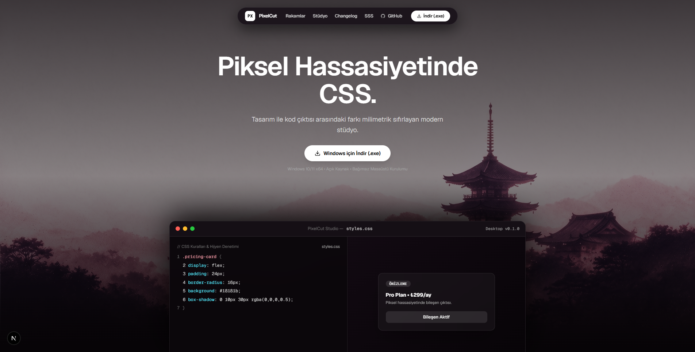

# PixelCut Studio

> **Piksel Hassasiyetinde CSS Dilimleme, Canlı Sınıf Radarı ve CSSBattle Platformu**



PixelCut Studio; modern web şablonlarından bileşen ayıklamayı (CSS slicing), temiz kod hijyen denetimini ve canlı üniversite laboratuvar eğitimini tek bir yerel masaüstü deneyiminde birleştiren profesyonel bir geliştirici stüdyosudur.

---

## 🌟 Öne Çıkan Özellikler

### 1. Monaco Destekli Kodlama Stüdyosu
- **Apple macOS Pencere Ergonomisi:** Pürüzsüz pencere sürükleme, özel başlık çubuğu ve minimalist koyu/açık temalar.
- **Canlı Önizleme:** Masaüstü tuval, iPhone mobil görünümü ve perde (diff slider) karşılaştırması.
- **Bileşen Hijyen Denetçisi:** Kod satır sayısı, gereksiz/kullanılmayan CSS yüzdesi ve otomatik temizlik puanı (Clean Score).

### 2. Canlı Sınıf Radarı & Eğitmen Müdahalesi (In-Class Lab)
- **Supabase Realtime Broadcast:** Öğrencinin tuş vuruşları veritabanı kotasını tüketmeden sıfır gecikmeli bellek içi WebSocket üzerinden hocanın radarına akar.
- **Canlı Müdahale:** Eğitmen tek tıkla öğrencinin çalışma alanına bağlanabilir, canlı kod düzeltmesi gönderebilir veya yardım çağrılarını yanıtlayabilir.
- **Yerel Taslak Koruması:** Öğrencinin yazdığı kodlar tarayıcıda `localStorage` taslaklarına anlık kaydedilir; veri kaybı yaşanmaz.

### 3. Ders Dışı CSSBattle Arenası (Practice)
- **Kademeli Zorluk Seviyeleri:** Kolay, Orta, İleri ve Uzman görevler.
- **Dinamik XP ve Liderlik Tablosu:** Çözülen görevlerin zorluğuna göre dinamik puanlama.
- **Bulut Teslim:** Görev bitirildiğinde nihai HTML + CSS paketi Supabase veritabanına tek bir hafif kayıt olarak iletilir.

### 4. Git & GitHub Kaynak Denetimi
- VS Code tarzı sol kenar çubuğu ve tam ekran commit ağacı.
- Commit farkları (diff preview), dal (branch) değiştirme ve GitHub senkronizasyonu.

---

## 🚀 Başlangıç ve Kurulum

### Gereksinimler
- Node.js 18+
- npm veya pnpm

### Bağımlılıkları Yükleme
```bash
npm install
```

### Masaüstü Geliştirici Modunu Başlatma
```bash
npm run desktop:dev
```
*Bu komut Next.js Turbopack sunucusunu ve Electron masaüstü kabuğunu eşzamanlı olarak başlatır.*

### Web Modunda Çalıştırma
```bash
npm run dev
```

### Kurulum Paketini (.exe) Derleme
```bash
npm run desktop:build
```

---

## 🛠️ Teknoloji Yığını

- **Kabuk:** Electron 44, electron-builder
- **Arayüz & Çatı:** Next.js 16 (Turbopack), React 19, TypeScript
- **Stil & Tasarım:** Tailwind CSS v4, Motion (Framer Motion)
- **Kod Editörü:** Monaco Editor (VS Code çekirdeği)
- **Backend & Gerçek Zamanlı İletişim:** Supabase (PostgreSQL 17, Row Level Security, Realtime Channels)
- **Görsel Eşleme:** Pixelmatch, html-to-image

---

## 📄 Lisans
Bu proje eğitim ve laboratuvar kullanımı amacıyla geliştirilmiştir.
